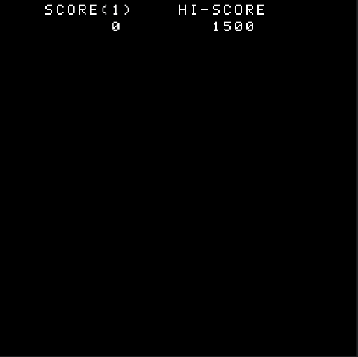
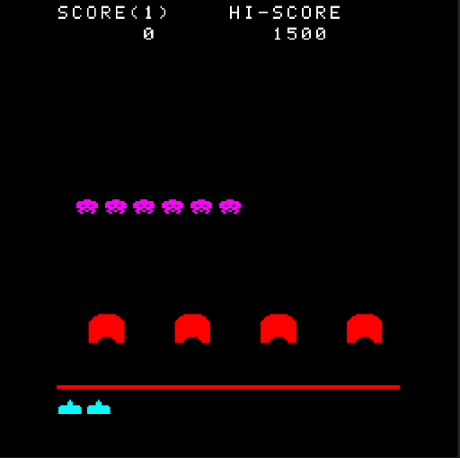

# Pyxel Invaders

## 概要
- ゲーム内容はスペースインベーダー。
- なんとなくこんな感じだったかなと作っています。
- 効果音は、frenchbreadさん作成の「Pyxel RPG SE パック」を使用しています。（歩行音のみ追加）

- カラーセロハンモードと白黒があります。
- キーボード、ジョイパッド、バーチャルゲームパッドに対応しています。
- キーボードでのショットキーは「Z」キー。

## GIFアニメ

## 動作確認
- [URL](https://sanbunnoichi1962.web.fc2.com/pyxel/pyxelinv.html)

## 更新履歴
2024.10.09 各種調整  
2024.08.15 btnp調整  
2024.07.24 新規追加
